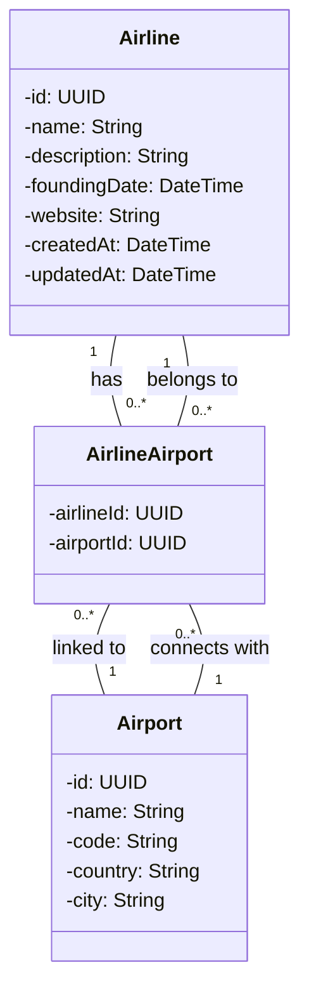

## Airport - Nestapp

Esta aplicación tiene el propósito de crear un sistema de consulta de cobertura de 
las aerolíneas. 


1. Cree la entidad Aerolinea en el módulo correspondiente. Una aerolínea tiene 
un nombre, una descripción, una fecha de fundación y una página web. 
2. Cree la entidad Aeropuerto en el módulo correspondiente. Un aeropuerto 
tiene un nombre, un código, un país y una ciudad. 
3. Incluya la asociación entre Aerolinea y Aeropuerto; tenga en cuenta que un 
aeropuerto cuenta con múltiples aerolíneas y una aerolínea tiene cobertura 
en distintos aeropuertos

### Diagrama de la base de datos

Adicionalmente se define el modelo físico  (Entidad/Relación) para visualizar implementación del modelo de datos.




## Project setup

```bash
$ yarn install
```

## Compile and run the project

```bash
# development
$ yarn run start

# watch mode
$ yarn run start:dev

# production mode
$ yarn run start:prod
```

## Run tests

```bash
# unit tests
$ yarn run test

# e2e tests
$ yarn run test:e2e

# test coverage
$ yarn run test:cov
```

